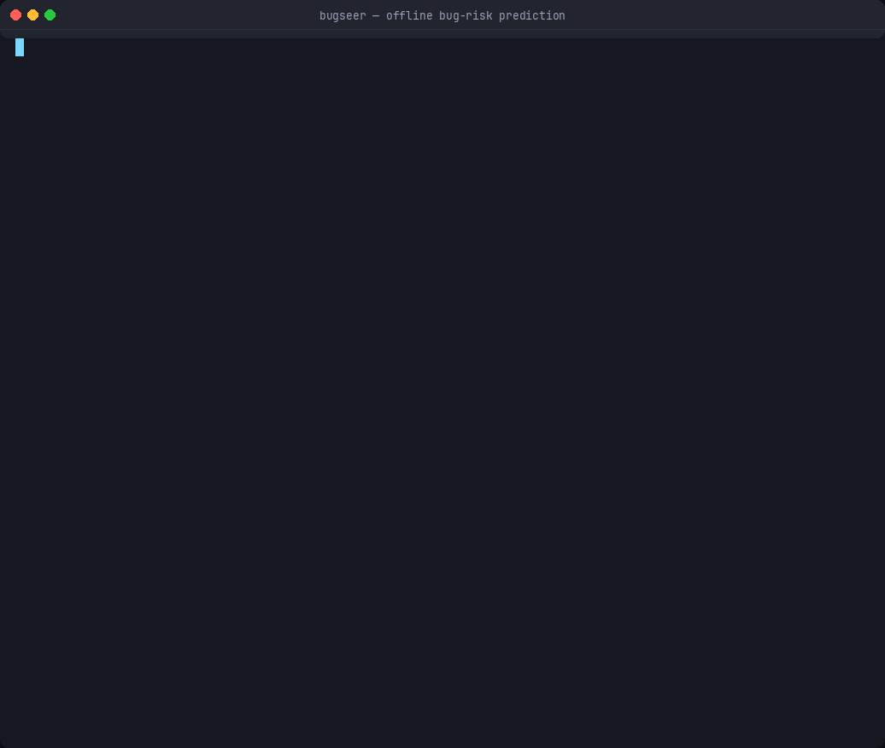

# 🔍 BugSeer

**Offline bug-risk prediction for code repositories.**
Static analysis + git intelligence + a local ML model — and an explanation for every number it shows you.

No cloud. No API keys. No telemetry. Your source code never leaves your machine.



```
🔥  97  ████████████████████  src/flask/app.py     Learned model predicts elevated defect risk · Mutable global state
🔴  74  ███████████████░░░░░  src/payment.py       High bug-fix density · No error handling · Deeply nested control flow
🟡  41  ████████░░░░░░░░░░░░  src/config.py        Frequently modified file
🟢  12  ██░░░░░░░░░░░░░░░░░░  src/utils.py         —
```

---

## Why this exists

Most "AI code review" tools give you a number and expect you to trust it. Developers don't, and they're right not to.

BugSeer's rule is simple: **every point of risk traces back to named, inspectable evidence.**

```
🔥 src/payment.py   96/100 (critical)
████████████████████████████████████████
static 102  ·  git 70  ·  raw 172 pts

  ⎇ +40 High bug-fix density  [bugfix-density]
      9 of 10 commits (90%) look like bug fixes. Code that has needed
      repeated repair tends to need more.

  ◆ +27 No error handling around risky operations  [no-error-handling]
      4 I/O, network, parsing or subprocess call(s) and zero try/catch
      blocks. Failures here surface as unhandled exceptions in production.

  ◆ +25 Deeply nested control flow  [deep-nesting]
      Maximum loop nesting is 3 and maximum block depth is 7 (threshold 3).
      ↳ L12 (depth 7), L28 (depth 7), L11 (depth 6)

  ⎇ +14 Previously reverted  [revert-history]
      1 revert/rollback commit(s) touched this file. A revert is direct
      evidence that a change here broke something in production.
```

You can argue with that. That's the point.

---

## Install

```bash
pip install -e ".[all]"     # everything
pip install -e .            # core only — still fully functional
```

| Extra | Adds | Without it |
|---|---|---|
| `parsers` | tree-sitter for 19+ languages | Python via stdlib `ast`, others via heuristics |
| `server` | FastAPI dashboard | Use the self-contained HTML report |
| `ml` | XGBoost / LightGBM | scikit-learn gradient boosting (built in) |
| `env` | `.env` file loading | Plain environment variables |

Every extra is optional. **Core BugSeer needs no network access at any point.**

---

## Quick start

```bash
bugseer scan .                        # rank files by risk
bugseer explain src/payment.py        # full reasoning for one file
bugseer heatmap .                     # colour-coded project tree
bugseer impact src/database.py        # "what if I change this?"
bugseer train .                       # learn from your own bug history
bugseer serve .                       # interactive dashboard
bugseer report . -o risk.html         # shareable offline HTML
```

---

## The five phases

### Phase 1 — Rule-based static analysis (no AI, no API)

Parsed with the best available backend: stdlib `ast` for Python (exact), tree-sitter for 19+ other languages, and a heuristic analyzer that never fails so an unknown language still gets scored.

| Rule | Points | Fires when |
|---|---|---|
| `no-error-handling` | 20 | Risky I/O with no try/catch |
| `low-coverage` | 20 | Measured coverage below threshold |
| `deep-nesting` | 15 | Nested loops deeper than 3 |
| `global-state` | 15 | Mutable module-level state |
| `high-complexity` | 12 | Cyclomatic complexity > 20 |
| `long-function` | 10 | Function longer than 100 lines |
| `high-branching` | 10 | More than 15 conditional branches |
| `duplicate-code` | 10 | Cloned blocks within or across files |
| `swallowed-exception` | 8 | `except:` / `catch(e){}` that hides failures |
| `god-file` | 8 | Over 600 lines |
| …plus magic numbers, TODO debt, mutable defaults, long parameter lists | | |

### Phase 2 — Git intelligence

Parses `git log` locally. No API, no network.

- **Change frequency** — the strongest empirical defect predictor
- **Bug-fix density** — how many commits here were repairs
- **Revert history** — direct evidence a change broke production
- **Fix-follow rate** — how often an edit here needed a follow-up fix within 7 days
- **Authorship spread** and single-owner bus-factor risk
- **Co-change coupling** — files habitually committed together

> Works on partial/blobless clones (`--filter=blob:none`), where `git log --numstat` would otherwise stall fetching blobs. BugSeer detects this, falls back to `--name-only`, and tells you churn is unavailable rather than silently reporting "no git history."

### Phase 3 — Learn from past bugs

```bash
bugseer train . --label-window 180
```

Trains locally on **your** repository. Labels come from bug-fix commits in a recent window; features come from history *before* that window — a temporal split, so the model is genuinely predictive rather than circular.

```
✓ Model trained
  Estimator           sklearn.GradientBoostingClassifier
  Samples             80 files (17 bug-fixed)
  ROC AUC (5-fold)    0.7652
  Label window        1095 days

What the model learned to look at:
  largest parameter list      █████████ 24.5%
  comment ratio               █████ 14.8%
  ownership concentration     ████ 10.0%
```

**Honesty guarantees**, because a prediction you can't trust is worse than none:

- Reported metrics are **out-of-fold** (5-fold CV), never training-set scores.
- Files in the training set get their **cross-validated** probability, not the memorised ~100% a fitted ensemble would return.
- Probabilities are clamped to 2–95%: a few dozen samples cannot justify certainty.
- Too little signal? It says so and keeps using rules, rather than fitting noise.

### Phase 4 — Project heat map

`bugseer heatmap` in the terminal, or `bugseer serve` for the React dashboard. Click any file for its full evidence chain.

### Phase 5 — "What if?" simulator

```bash
$ bugseer impact src/flask/app.py

If you modify src/flask/app.py, 25 file(s) are most likely to be affected.

Impact              File                    Own risk  Why
    65  ██████░░    src/flask/sessions.py         66  directly imports `app.py`;
                                                      changed together in 22% of commits
    52  █████░░░    tests/test_basic.py           93  depends on `globals.py` transitively
                                                      (2 hops); is itself high-risk
```

Combines the **import graph** with **historical co-change**, weighted by each candidate's own fragility — and explains every prediction.

---

## Configuration

```bash
bugseer init          # writes a starter .bugseer.toml
```

```toml
[bugseer]
history_days = 730
exclude = ["docs/*", "examples/*"]
# coverage_file = "coverage.xml"

[bugseer.weights]
no_error_handling = 20
change_frequency = 15

[bugseer.thresholds]
long_function_lines = 100
band_critical = 85
```

Precedence: **CLI flags → `.bugseer.toml` → environment/`.env` → defaults.**

### Test coverage

BugSeer auto-detects `coverage.xml`, `lcov.info`, `coverage.json`, and Clover. Without one it falls back to a filename heuristic — and **labels it as such**, so a guess is never mistaken for a measurement.

---

## CI usage

```yaml
- run: pip install -e ".[parsers]"
- run: bugseer scan . --fail-over 85 --ignore-tests
```

Exits non-zero when any file exceeds the threshold. Add `--json report.json` to archive results.

---

## The optional AI narrator

**BugSeer needs no API key.** All five phases above are deterministic and offline.

The *only* optional AI feature rewrites already-computed evidence as prose:

```bash
cp .env.example .env       # then set one key
bugseer explain src/payment.py --narrate
```

Supports **OpenAI**, **Anthropic (Claude)**, **Gemini**, and **Ollama** (local).

Safety properties, enforced by tests:

- It **cannot change a score** — it receives finished evidence, and the score is computed before it runs.
- It sends **metrics and rule names only**; source code requires explicit `BUGSEER_AI_SEND_SOURCE=1`.
- `BUGSEER_OFFLINE=1` blocks all outbound requests even if a key is set.
- `BUGSEER_AI_REDACT_PATHS=1` hashes file paths before transmission.
- Any failure degrades gracefully to the deterministic explanation.

See [`.env.example`](.env.example) — every variable in it is optional.

---

## Dashboard

```bash
bugseer serve .        # http://127.0.0.1:8420
```

React + TypeScript, bound to localhost. The build is committed, so it runs without a node toolchain. If the bundle is missing, the server falls back to the static HTML report.

To develop the frontend:

```bash
cd frontend && npm install && npm run dev    # proxies /api to :8420
```

---

## Architecture

```
bugseer/
├── analysis/
│   ├── static.py       Phase 1 — ast | tree-sitter | heuristic backends
│   ├── langspec.py     Declarative grammar vocabularies (19+ languages)
│   └── duplication.py  Rolling-hash clone detection
├── git_intel.py        Phase 2 — git log parsing, coverage reports
├── rules.py            Scoring engine — every hit carries its evidence
├── ml.py               Phase 3 — local model, out-of-fold honesty
├── graph.py            Phase 5 — dependency graph + impact simulation
├── scanner.py          Orchestration (parallel, with serial fallback)
├── server.py           Phase 4 — FastAPI dashboard
├── report.py           Self-contained HTML output
├── narrate.py          Optional AI narrator (stdlib urllib only)
└── cli.py              Typer CLI
```

**Adding a language** is a few lines of data in `langspec.py`.
**Adding a rule** is one function in `rules.py` returning a `RuleHit` with its evidence.

---

## Testing

```bash
pytest -q        # 104 tests
```

Covers the analyzers, rule scoring, git parsing, coverage formats, the graph, impact simulation, ML degradation paths, the CLI, and the narrator's privacy guarantees. Verified end-to-end against a real repository (Flask: 84 files, 5,539 commits) and a battery of pathological inputs — binary files, invalid UTF-8, syntax errors, 800 KB files, broken symlinks, empty files.

---

## Performance

Flask (84 files, 13k LOC, 3,812 commits analysed): **~1.0s** full scan on 8 workers.

---

## Design decisions worth knowing

- **Additive scores, saturating curve.** Raw points are summed then squashed to 0–100, so eight moderate problems and one catastrophic one both land sensibly.
- **Rules over ML by default.** The model is opt-in and additive; it only moves a score when it genuinely disagrees with the repo baseline.
- **Naming heuristics are labelled.** "No matching test file" never masquerades as measured coverage.
- **Trivial files score zero.** Empty files and constants-only modules generate no findings — noise is how a tool gets ignored.
- **Graceful degradation everywhere.** No git, no tree-sitter, no model, no network: BugSeer still produces a useful report and tells you what it couldn't do.

---

## License

MIT
